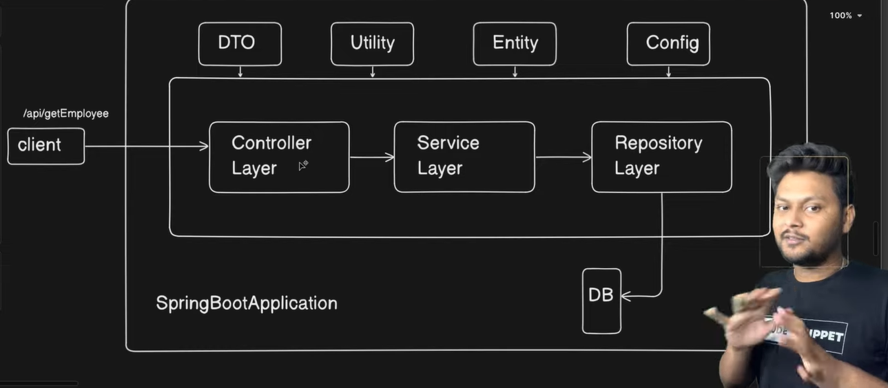
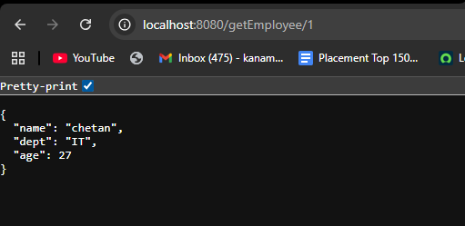

# Spring Boot Layered Architecture (Step-by-Step)

## Step 1: Create Spring Boot Project
- Create project using Spring Initializr
- Add dependencies:
    - Spring Web
    - Spring Data JPA
    - H2 / MySQL
- Run the application and verify `localhost:8080`

---

## Step 2: Create Layered Packages
Create the following packages:
- controller
- service
- repository
- dto
- entity
- util
- config
  
---

## Step 3: Controller Layer
- Entry point of the application
- Handles HTTP requests
- Forwards request to Service layer
- No business logic

Annotations used:
- `@RestController`
- `@GetMapping`
- `@PostMapping`

```java
package com.codesnippet.spring_demo_application.Controller;

import com.codesnippet.spring_demo_application.Service.EmployeeService;
import com.codesnippet.spring_demo_application.dto.EmployeeDTO;
import org.springframework.beans.factory.annotation.Autowired;
import org.springframework.http.ResponseEntity;
import org.springframework.web.bind.annotation.GetMapping;
import org.springframework.web.bind.annotation.PathVariable;
import org.springframework.web.bind.annotation.RestController;

@RestController
public class EmployeeController {

    @Autowired
    EmployeeService employeeService;

    @GetMapping("/getEmployee/{id}")
    public ResponseEntity<EmployeeDTO> getEmployee(@PathVariable Integer id) {
        EmployeeDTO employee = employeeService.getEmployee(id);
        return ResponseEntity.ok(employee);
    }
}

```

---

## Step 4: Service Layer
- Contains business logic
- Calls Repository layer
- Converts Entity ↔ DTO

Annotations used:
- `@Service`
- `@Autowired`
```java
  package com.codesnippet.spring_demo_application.Service;

import com.codesnippet.spring_demo_application.Repository.EmployeeRepository;
import com.codesnippet.spring_demo_application.dto.EmployeeDTO;
import com.codesnippet.spring_demo_application.entity.Employee;
import org.springframework.beans.factory.annotation.Autowired;
import org.springframework.stereotype.Service;

@Service
public class EmployeeService {

    @Autowired
    EmployeeRepository employeeRepository;

    public EmployeeDTO getEmployee(Integer id) {
        Employee employee = employeeRepository.getEmployee(id);

        EmployeeDTO employeeDTO = new EmployeeDTO();
        return employeeDTO.EmployeeMapper(employee);
    }
}

```

---

## Step 5: Repository Layer
- Interacts with database
- Executes DB operations
- Returns Entity objects

Annotations used:
- `@Repository`
- `@Entity`
- `@Id`
```java
package com.codesnippet.spring_demo_application.Repository;

import com.codesnippet.spring_demo_application.entity.Employee;
import org.springframework.stereotype.Repository;

@Repository
public class EmployeeRepository {

    public Employee getEmployee(Integer id) {
        return new Employee(1, "chetan", "IT", 27);
    }
}

```

---

## Step 6: Entity Layer
- Represents database table
- Maps columns to fields
- Used only for DB operations
```java
package com.codesnippet.spring_demo_application.entity;

import jakarta.persistence.Entity;
import jakarta.persistence.Id;

@Entity
public class Employee {

    @Id
    private Integer id;
    private String name;
    private String dept;
    private Integer age;

    public Employee() {
    }

    public Employee(Integer id, String name, String dept, Integer age) {
        this.id = id;
        this.name = name;
        this.dept = dept;
        this.age = age;
    }

    public Integer getId() {
        return id;
    }

    public String getName() {
        return name;
    }

    public String getDept() {
        return dept;
    }

    public Integer getAge() {
        return age;
    }
}

```

---

## Step 7: DTO Layer
- Used for client communication
- Hides database structure
- Returned as API response
```java
package com.codesnippet.spring_demo_application.dto;

import com.codesnippet.spring_demo_application.entity.Employee;

public class EmployeeDTO {

    private String name;
    private String dept;
    private Integer age;

    public String getName() {
        return name;
    }

    public void setName(String name) {
        this.name = name;
    }

    public String getDept() {
        return dept;
    }

    public void setDept(String dept) {
        this.dept = dept;
    }

    public Integer getAge() {
        return age;
    }

    public void setAge(Integer age) {
        this.age = age;
    }

    public EmployeeDTO EmployeeMapper(Employee employee) {
        this.setName(employee.getName());
        this.setDept(employee.getDept());
        this.setAge(employee.getAge());
        return this;
    }
}

```

---

## Step 8: Utility Layer
- Contains common reusable logic
- Example:
    - Mapper classes
    - Helper methods

---

## Step 9: Configuration Layer
- Stores external configuration
- Uses `application.properties`
- Accessed using `@Value`

---

## Step 10: Request Flow

